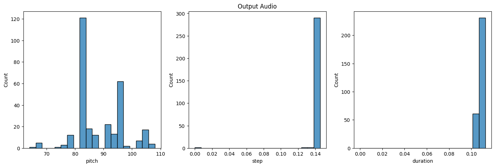

For our group project we will be making a music generation application utilizing machine learning. Prior research has been conducted in this area with researchers experimenting with which different neural network architectures produces the desired output music. One popular approach is Generative Adversial Networks. GAN models primarily work by creating new data that resembles the training data. However, in regards to music generation, GAN is still behind primarily for being notoriously hard to train to achieve impressive results. Instead, our approach to music generation will be focused on a Recurrent Neural network approach, the other popular method used for music generation. Some research of RNN music generation includes work done by Hadjeres et al. who proposed an architecture named Anticipation-RNN composed primarily of two recurrent neural networks that featured unary constraints on notes (2017). Further research has been conducted by Briot & Pachet who address some of the main challenges involved in deep learning for music generation including aspects of user control, lack of incremental development found in human music creation, and tendencies for memorization/plagiarism (2020). Additionally, Sturm et al tested different machine learning models for music generation and found that the models often generated music that sounded much different from the music from the models’ training data, which, while a limitation, showed that the training data these models used was just one of many factors going into the generated output (2019). We plan to address some of these issues later on when designing out model. As for our dataset, we plan on utilizing the [NES music database](https://github.com/chrisdonahue/nesmdb) for training our model. This dataset has been excellently crafted by Chris Donahue and collegues that translated all the NES machine code into a clean, organized MIDI dataset. The dataset includes multiple features such variables such as pitch, duration, and step, which gives us tremendous flexibility in modifying the type of music our model will generate.

# References
Briot, JP., Pachet, F. Deep learning for music generation: challenges and directions. Neural Comput & Applic 32, 981–993 (2020). https://doi.org/10.1007/s00521-018-3813-6

Hadjeres, G., & Nielsen, F. (2017). Interactive music generation with positional constraints using 
anticipation-rnns. arXiv preprint arXiv:1709.06404.

Bob L. Sturm, Oded Ben-Tal, Úna Monaghan, Nick Collins, Dorien Herremans, Elaine Chew, Gaëtan Hadjeres, Emmanuel Deruty & François Pachet (2019) Machine learning research that matters for music creation: A case study, Journal of New Music Research, 48:1, 36-55, DOI: 10.1080/09298215.2018.1515233 

# Problem definition
One of the most important aspects of the user experience in video games is music. However, most indie and individual game developers do not have a musical background. So, our goal is to provide an accessible tool for game developers to enhance their games with music, regardless of their musical experience or background.

# Data Collection
The music database we are working with includes a large amount of audio files that are sound effects. We cleaned our dataset by removing these files to ensure that our dataset contains only music soundtracks. We differentiated between sound effect and song by setting a length threshold of 30 seconds and removing all sound files that are less than this threshold. Files with a length greater than 30 seconds were kept as part of our training dataset.

# Methods
We will use Tensorflow as our primary library for creating our music generator. Music from the NES music database will be ingested as MIDI files and processed with PrettyMIDI. The data is stored in a MIDI format and was already cleaned to begin with. MIDI isn’t a playable audio source, it is a source of musical information such as pitch, timing, etc. that tells other devices what to play depending on the musical library it has. The dataset we’re using is already clean to begin with but we are processing the information to tailor fit our purposes. The dataset includes information like note, velocity, and timbre but we’re going to be focusing on pitch duration and step for the model. Notes will be extracted along with their respective pitch, step, and duration and converted into a training dataset. A model will be created with LSTM and dense layers using Adam as the optimizer and Tensorflow’s SparseCategoricalCrossentropy as the loss function. The resulting model generates musical notes in a sequence with a given temperature variable that controls the randomness of notes.

To generate music, we fed our model a sequence of notes pulled from a random MIDI file that was not part of our training dataset. Our model generated a predefined number of notes that were based on the inputted notes. These notes plus the inputted note sequence formed the basis of our generated music.

# Results and Discussion

Each of our dataset's features (pitch, step, duration) were skewed in a particular direction. Duration tended to be skewed towards the left, which was understandable since generally speaking, most musical notes are brief. Step (distance between notes) was also skewed towards the left, which also followed expectations since music notes tend to "stick together" or incrementally change (large steps do exist, but at a lower rate as shown in our graph). Pitch had a tendency to be grouped in the middle where the pitch was not too high nor too low (50-100). This trend also meets expectations since most songs do not tend to have drastically high or low pitch notes. We compiled the pitch, step, and duration of every song in our training dataset into one histogram shown below.

After generating our song, we plotted the distribution of notes shown below:

We judged the results of our generated song by how closely they followed the distribution of pitch, step, and duration in our training dataset. As seen in the histogram below, our generated music only followed the pitch feature in our dataset (centered roughly between 50-100) but the step and duration heavily deviated from the patterns exhibited in the training dataset. The step and duration seemed to be solely clustered around one point (step=0.14,duration~=0.12), which did not align with our training dataset's pattern of being more dispersed. We also found there to be issues with the overall melody and musical appeal of the song.

We quantitatively evaluated our model by measuring the similarity between our generated song and our training dataset by using chi squared distance. The formula we used can be found below:

Where O represents the observed frequency and E represents the expected frequency. To determine how closely our generated songs followed our training dataset, we averaged the pitch, step, and duration of all notes in our training dataset to create a 1 x 3 vector that served as our "expected frequency." The observed frequency was an n x 3 matrix where each row corresponded to a note in the generated song and each column corresponded with each of the note's features (pitch, step, duration). The 'expected' vector was broadcast for all rows in our observed matrix to obtain a chi squared distance value. This value was calculated for each of the 3 features, so a total of 3 chi squared distances were obtained per song. This value measured the similarity between the generated song (n x 3 matrix) and the songs in our dataset (1 x 3 vector).

A total of 30 chi squared values were calculated (3 for each feature, 10 songs total) and averaged by feature. The calculated values can be seen below:

The chi squared distance for our pitch feature was significantly larger than the values for the other two features. This value tells us that the pitch in our generated songs greatly deviates from the average pitch in our training dataset, while the step and duration more closely follow the dataset's trend. We suspect that the underlying cause of this is related to the temperature value we set, which controls for the diversity in the generated notes. For our final report, we aim to experiment with different temperature values to see if higher values allow for notes with pitches that are closer to those found in the training dataset.

For our final report, we plan to make adjustments to the architecture of our model and tune several parameters that influence the output of our song (temperature, # of generated notes, etc). The basis of our model centers around an LSTM layer which is effective for predicting future sequences and is responsible for the majority of our project. Since the only other layer is a dense layer (acting as our output layer), we aim to increase the size of our model by experimenting with adding other layers to modify both the input layers prior to the LSTM layer and the output layers coming out of the LSTM layer to see if the generated song would be significally impacted along with its musical appeal. We surmised that the low musical appeal in our current songs could be due to the overwhelmingly basic architecture of our deep learning model that features only an input LSTM layer, dense output layers, and no hidden layers. 

We also hope that adding more hidden layers and tuning the hyperparameters of our model will create more variety in the step and duration of our generated song. The lack of variety in step and duration leads us to believe that this may have been influenced by the basic architecture of our model as well.

# Timeline
Below is a link to our Gantt chart which organizes our projects timeline
https://1drv.ms/x/s!AruP9H8mQDWubexK-SrZNCJPWfw?e=P1U0k2

# Contributions table
| Name | Disha | Cason | Emily | William | Derek |
| ---- | ----- | ----- | ----- | ------- | ----- |
| Task completed | research for introduction, powerpoint, exploring datasets, helped setup python notebook to run all of our code | Create github pages, problem definition, references, powerpoint, improved introduction, made histogram visualizations | Added MusPy Source, Filmed and edited video, conducted more research, updated report, helped debug and code python notebook | Found Briot source, added information to introduction, Potential Results, Part of powerpoint, made piano note visualizations of midi data, helped debug and code python notebook | Dataset cleaning, setup model architecture, results & discussion section, helped code and debug python notebook |
